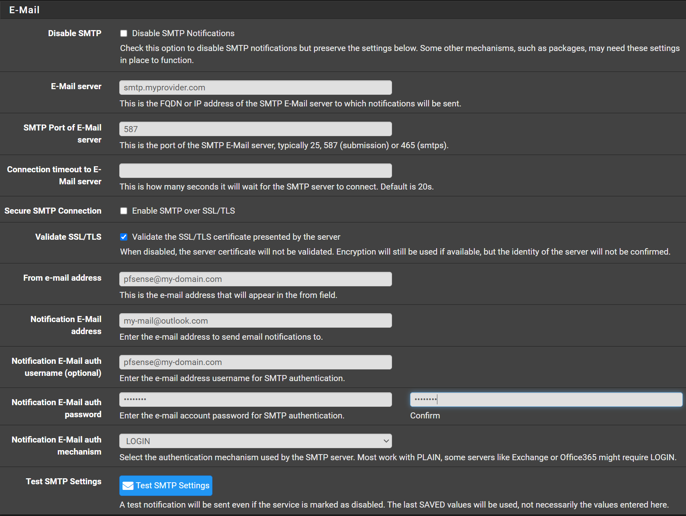

# E-mail

Let's enable Mail notifications

Navitgate to `System` -> `Advanced` -> `Notifications`

- E-Mail server: `smpt-server-of-your-mail-provider`
- SMTP Port of E-Mail server: `smtp-port-of-your-mail-provider`
- Secure SMTP Connection: `Enable if your mail provider supports it`
- Validate SSL/TLS: `Enable if your mail provider supports it`
- From e-mail address: `The address where the mail will be sent from`
- Notification E-Mail address: `The address where you want to receive notifications`
- Notification E-Mail auth username (optional): `The mail that will be used to authenticate to the smtp server`
- Notification E-Mail auth password: `The password that will be used to authenticate to the smtp server`
- Notification E-Mail auth mechanism: `LOGIN` or `PLAIN` depending on what your provider support.

Click <kbd>Test SMTP Settings</kbd>

If you entered everything correct, you should receive a test mail on the `Notification E-Mail address` you set above.
If you do receive it, you are ready!

Click <kbd>💾Save</kbd>
