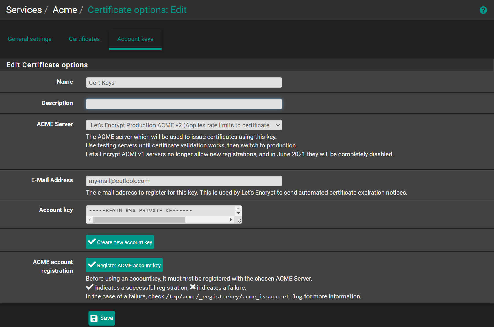
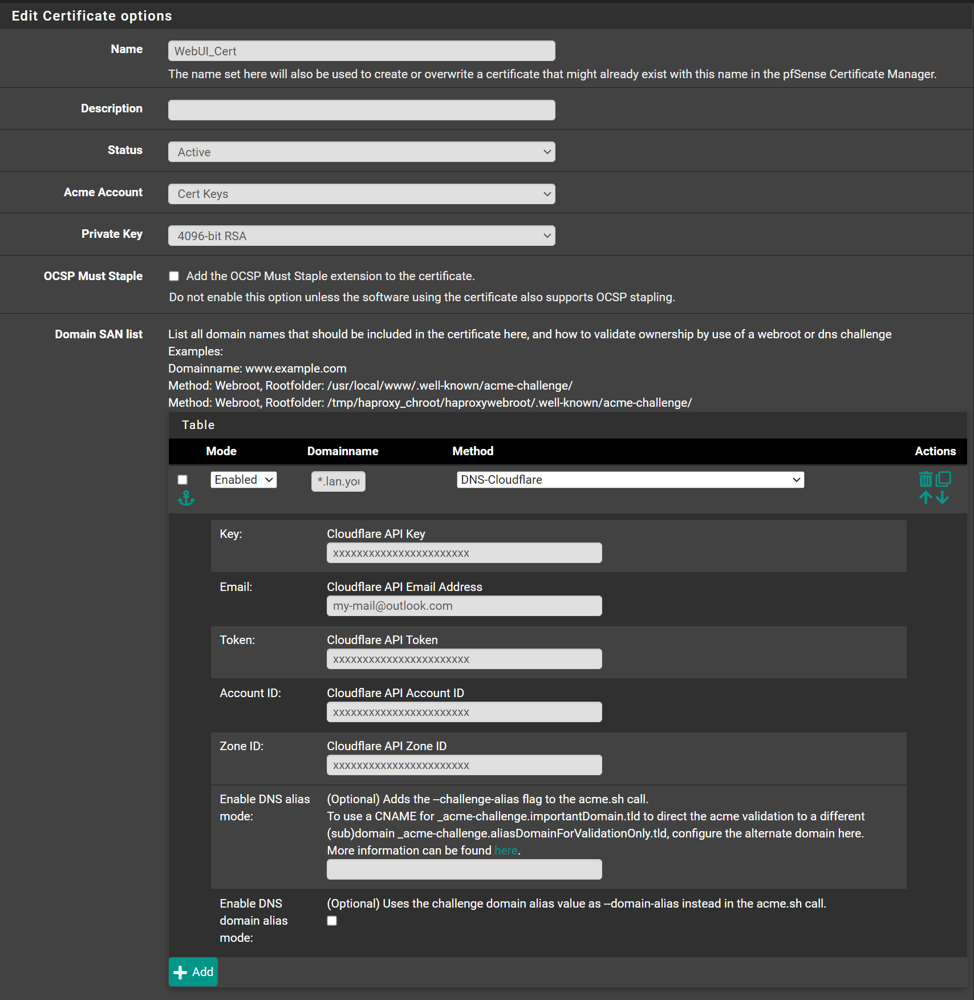
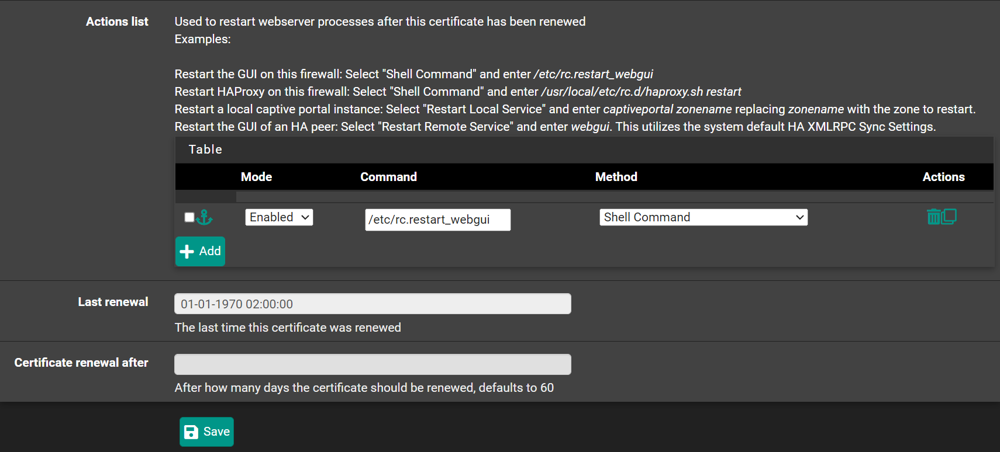

# Configuration

## Create account keys

Navigate to `Sevices` -> `Acme Certificates` -> `Account keys`

- Click <kbd>➕Add</kbd>
- Name: `Cert Keys`
- ACME Server: `Let's Encrypt Production ACME v2`
- E-Mail Address: `my-mail@outlook.com`
- Click <kbd>➕Create new account key</kbd>
- Click <kbd>➕Register ACME account key</kbd>
- Click <kbd>💾Save</kbd>

## Create certificate

Navigate to `Sevices` -> `Acme Certificates` -> `Certificates`

Zone ID:
  - Navigate to your Cloudflare account
  - Select your domain.
  - Scroll down to `API`

Account ID:
  - Navigate to your Cloudflare account
  - Select your domain.
  - Scroll down to `API` on the right sidebar

Token: (You can use the API Token you created for Dynamic DNS)
  - Navigate to your Cloudflare account
  - Click on the top right corner.
  - Click `My Profile`
  - Click `API Tokens` on the left sidebar
  - Click <kbd>Create Token</kbd>
  - Click <kbd>Use template</kbd> on `Edit zone DNS
    - Permissions:
      - `Zone` - `DNS` - `Edit
    - Zone Resources
      - `Include` - `Specific zone` - `your-domain.com`
  - Click <kbd>Continue to summary</kbd>
  - Click <kbd>Create Token</kbd>

Key:
  - Navigate to your Cloudflare account
  - Click on the top right corner.
  - Click `My Profile`
  - Click `API Tokens` on the left sidebar
  - Click <kbd>View</kbd> on `Global API Key`

- Click <kbd>➕Add</kbd>
- Name: `WebUI_Cert`
- Status: `Active`
- Acme Account: `Cert Keys`
- Private Key: `4096-bit RSA`
- Domain SAN list:
  - Domainname: `*.lan.your-domain.com`
  - Method: `DNS-Cloudflare`
    - Key: `Global API Key`
    - Email: `my-mail@outlook.com`
    - Token: `API Token`
    - Account ID: `Account ID`
    - Zone ID: `Zone ID`

  - Actions list:
    - Click <kbd>➕Add</kbd>
    - Mode: `Enabled`
    - Command: `/etc/rc.restart_webgui`
    - Method: `Shell Command`
- Click <kbd>💾Save</kbd>

- Click <kbd>✔️Issue/Renew</kbd>

If you see a green message after some seconds, it means certificate issuance succeeded.

## Use the certificate

Navitagate to `System` -> `Advanced` -> `Admin Access

- SSL/TLS Certificate: `WebUI_Cert`
- Alternate Hostnames: `FQND of your firewall` (eg. fw.lan.your-domain.com)
- Click <kbd>💾Save</kbd>

