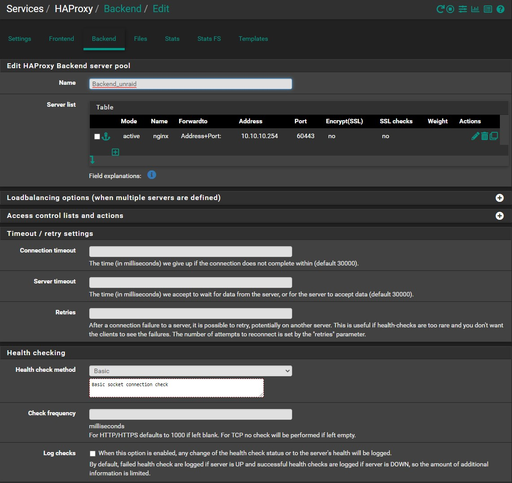
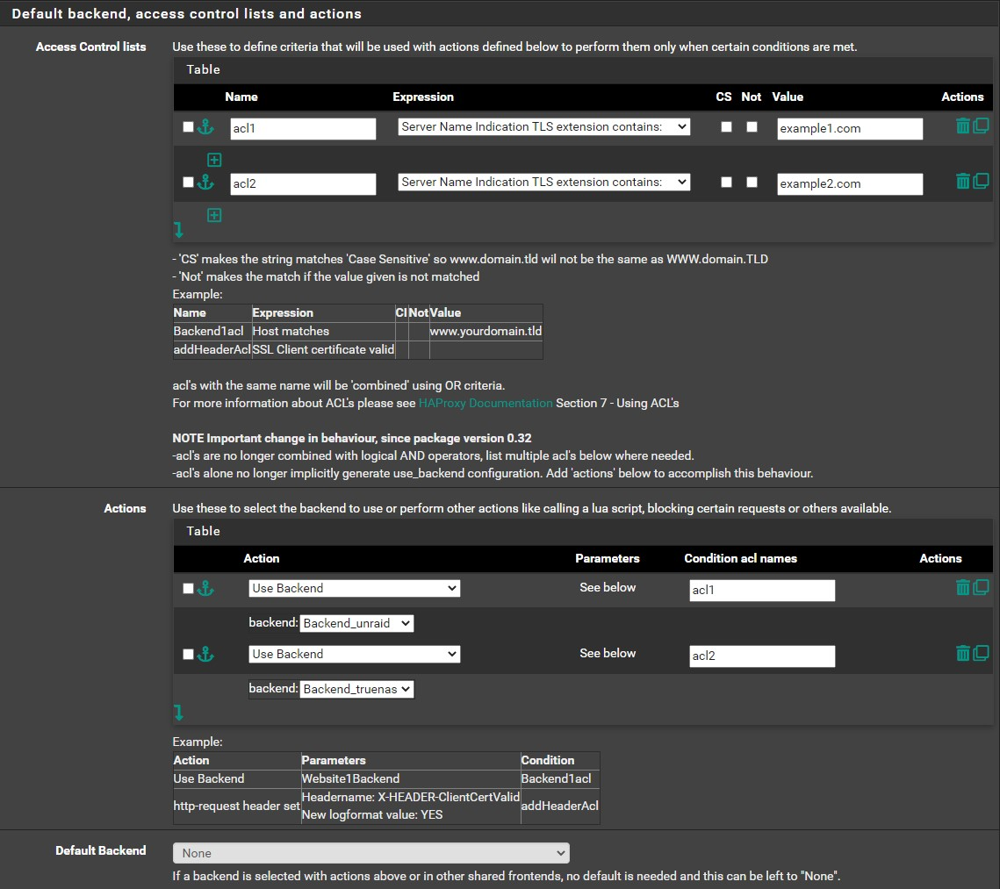

# SNI

## Overview

We will redirect multiple domains to multiple local servers using SNI

In this guide we will configure multiple domains (`example1.com`, `example2.com`) to redirect to specific local server (`10.10.10.254`, `10.10.10.230`) using the same port (`HTTPS/443`)

For this example our local servers are using reverse proxies and each server issue it's own certs using let's encrypt, and only accepting HTTPS traffic.
(Let's encrypt uses DNS validation (Cloudflare) so we don't need `HTTP/80` port open)

## Backend

Navigate to `Services` -> `HAProxy` -> `Backend` -> `Add`

- Name your backend (eg. `Backend_truenas`)
- Click ⤵️ on Server List
  - Name: `traefik`
  - Address: `10.10.10.230` (Put here the address of your server)
  - Port: `443`
  - Encrypt(SSL): `Unchecked`
  - SSL Checks: `Unchecked`
- Health checking
  - Health check method: `Basic` (You can try `SSL` also)
- Click <kbd>💾Save</kbd>

Repeat for the other servers

## Frontend

Navigate to `Services` -> `HAProxy` -> `Frontend` -> `Add`

- Name your frontend (eg. `Frontend-SNI`)
- External Address
  - Listen Address: `WAN address (IPv4)`
  - Port: `443`
- Type: `ssl / https(TCP Mode)`

- Access Control lists
  - Click ⤵️
  - Name: `acl2` (Pick any name you want)
  - Expression (to match whole domain): `Server Name Indication TLS extension contains:`
  - CS: `Unchecked`
  - Not: `Unchecked`
  - Value: `example2.com` (put your domain here)
  - Repeat ACL steps for all your domains
- Actions
  - Click ⤵️
  - Action: `Use Backend`
  - Condition acl names: `acl2` (Here you have to use the exact name of one of the ACL's you configured)
  - backend: `Backend_truenas` (Here select the backend you want to redirect when the ACL matches the domain)
  - Repeat Action steps for all your backends

## Check if everything is working

Navigate to `Status` -> `HAProxy Status`

If everything is setup correctly, you should have Green Lines for each backend.
If you see Red Line for any backend, you probably have missed something.

