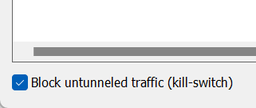

# Peers

Navigate to `VPN` -> `WireGuard` -> `Peers`

- Tunnel: `tun_wg0 (tun_01)`
- Description: `My Device`
- Public Key: `Your Device's Public Key`
- Allowed IPs: `10.30.0.2` / `32`


You will get `Public Key` from your peers. See below

## Windows

- Open WireGuard Application
- Click <kbd>⬇️</kbd> Right of `Add Tunnel`.
- Click `Empty Tunnel`
- Copy `Public Key`. Use this when creating a peer on pfSense.


Once you create th peer on pfSense, go back to Windows Application

### Split Tunnel

This will only send traffic to your pfSense when it's destination
is in one of the `AllowedIPs` networks

```bash
[Interface]
PrivateKey = +BTMy8yLkq/yDQYFXZW1HGs7YqCFmG+gAxxS7uhWeGA=
# Put the IP you entered on Allowed IPs when creating the peer.
# Note that here we use "/24" instead of "/32"
Address = 10.30.0.2/24
# This is the DNS of your pfSense
DNS = 10.1.1.1

[Peer]
# This is the Public Key from your pfSense Tunnel.
# Go edit your tunnel and get the public key
PublicKey = thisisa/publickey=
# This is your pfSense's WAN IP (Public IP)
Endpoint = vpn.domain.com:51820
# Here list all the networks you want this peer to reach inside your network
AllowedIPs = 10.1.1.0/24, 10.2.2.0/24
```

### Full Tunnel

This will force all your traffic to go through your pfSense and then
out to internet.

```bash
[Interface]
PrivateKey = +BTMy8yLkq/yDQYFXZW1HGs7YqCFmG+gAxxS7uhWeGA=
# Put the IP you entered on Allowed IPs when creating the peer.
# Note that here we use "/24" instead of "/32"
Address = 10.30.0.2/24
# This is the DNS of your pfSense
DNS = 10.1.1.1

[Peer]
# This is the Public Key from your pfSense Tunnel.
# Go edit your tunnel and get the public key
PublicKey = thisisa/publickey=
# This is your pfSense's WAN IP (Public IP)
Endpoint = vpn.domain.com:51820
# Here list all the networks you want this peer to reach inside your network
AllowedIPs = 0.0.0.0/0
```

Also check the box `Block untunneled traffic (kill-switch)`


