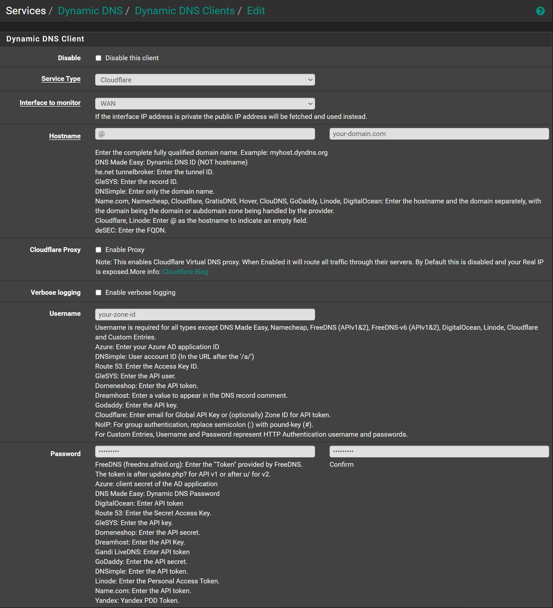

# Setup

## Dynamic DNS
Navigate to `Services` -> `Dynamic DNS`

Click <kbd>➕Add</kbd>

- Service Type: `Cloudflare`
- Interface to monitor: `WAN`
- Hostname: `@` `your-domain.com`
- Username: `your-zone-id`
- Password: `api-token`
- Description: `Cloudflare`

Click <kbd>Save</kbd>

## Zone ID

To get the `Zone ID`, login to your Cloudflare account.
Navitaget to `Account Home` (Top right corner, on the human icon)
Select `your-domain.com`.
On the right sidebar, near the bottom. Under `API`, there is the `Zone ID`.
Copy and paste it into `Username` field in pfSense

## API Token

To get an `API Token`, login to your Cloudflare account.
Navigate to `My Profile` (Top right corner, on the human icon)
On the left sidebar click `API Tokens`
Click <kbd>Create Token</kbd>

From templates select `Edit zone DNS`, click on `Use template`

Under `Permissions` you should add the following:

`Zone` -> `Zone Settings` -> `Read`
`Zone` -> `Zone` -> `Read`
`Zone` -> `DNS` -> `Edit`

Under `Zone Resources` you should add the following:

`Include` -> `Specific zone` -> `your-domain.com`

Click <kbd>Continue to summary</kbd>
Click <kbd>Create Token</kbd>

<kbd>Copy</kbd> the token and paste it into `Password` field in pfSense
