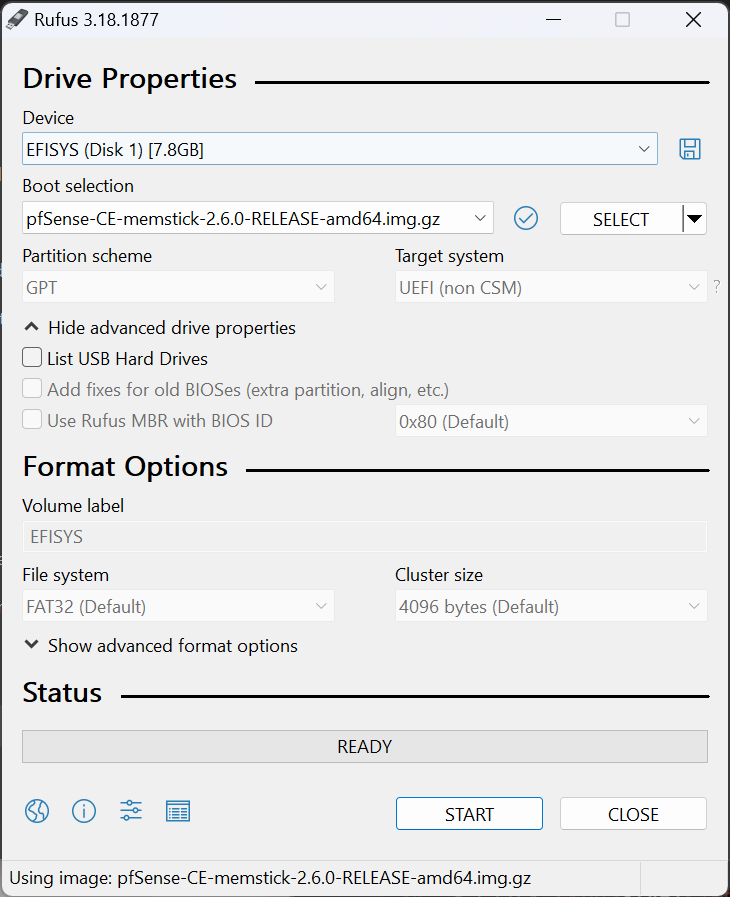

# Preparation

## Download installer and tools

Download the installer from pfSense official download [page](https://www.pfsense.org/download/)

* Select `AMD64 (64-bit)` as `Architecture`
* Select `USB Memstick Installer` as `Installer` for bare metal installation or `DVD Image (ISO) Installer` for virtualized installation
* Select `VGA` as `Console`
* Select the `Mirror` closest to you
* Click <kbd>Download</kbd>
*

> You can skip `Rufus` and `Prepare the installation media (USB)`
if you plan to do a virtualized installation
{.is-info}
### Rufus
Download rufus from their official [site](https://rufus.ie/en/)
Select either the portable version or the installer, both will work.

## Prepare the installation media (USB)

:::danger Destructive move

This process will **DELETE** any data in your USB stick.

:::

* Run `Rufus`
* Select your USB Stick on the `Device` drop down list
* On `Boot selection` Click <kbd>SELECT</kbd> and select the OPNsense installer we downloaded earlier
* Check again that you selected the correct `Device` on previous step
* Click <kbd>START</kbd>
* Accept the **WARNING** saying that will **DESTROY** your data on this device

Once the process is finished you are ready to install pfSense to your machine.

## Prepare the installation media (Virtualized)

* Mount the ISO file into your VM
* Set it as primary boot device
