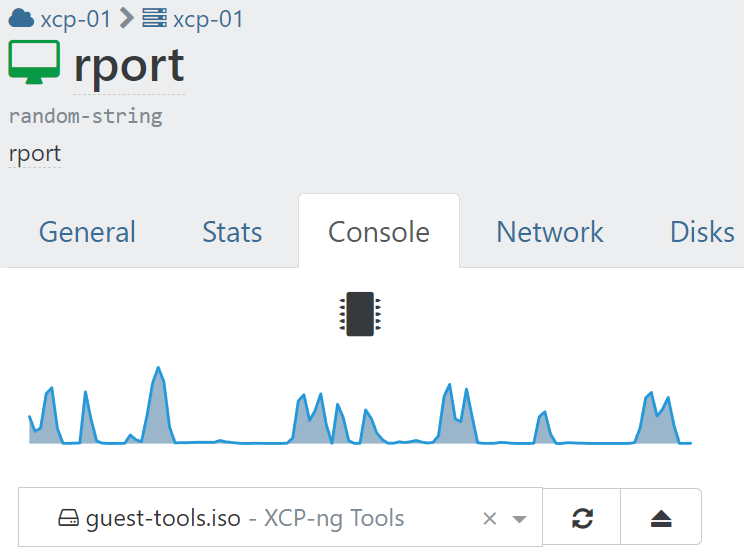

# First things to do - Ubuntu VM

After installing an Ubuntu VM, this is some things I personally do first.

## Update the system

```shell
sudo apt update
sudo apt upgrade -y
```

## Install guest tools (Optional)

- On XenOrchestra navigate to the console tab of your VM
- Mount the `guest-tools.iso` on the dropdown



```shell
sudo mount /dev/cdrom /mnt
sudo /mnt/Linux/install.sh
sudo umount /dev/cdrom
sudo reboot
```

Example output:

```shell
user@rport:~$   sudo mount /dev/cdrom /mnt
sudo /mnt/Linux/install.sh
sudo umount /dev/cdrom
mount: /mnt: WARNING: source write-protected, mounted read-only.
Detected `Ubuntu 22.04 LTS' (ubuntu version 22).

The following changes will be made to this Virtual Machine:
  * packages to be installed/upgraded:
    - xe-guest-utilities_7.20.0-9_amd64.deb

Continue? [y/n] y

(Reading database ... 74231 files and directories currently installed.)
Preparing to unpack .../xe-guest-utilities_7.20.0-9_amd64.deb ...
Unpacking xe-guest-utilities (7.20.0-9) over (7.20.0-9) ...
Setting up xe-guest-utilities (7.20.0-9) ...

You should now reboot this Virtual Machine.
```

## Set static IP

You need to create a file `/etc/netplan/01-netcfg.yaml` with your static IP configuration

```shell
sudo nano /etc/netplan/01-netcfg.yaml
```

Paste the following inside and change to match your network setup
`10.1.1.233` is the IP I want for this server
`10.1.1.1` is the IP of my firewall
`eth0` is your interface, view it with `ip a`

```shell
ip a
```

Example output:

```shell
user@tactical:~$ ip a
1: lo: <LOOPBACK,UP,LOWER_UP> mtu 65536 qdisc noqueue state UNKNOWN group default qlen 1000
    link/loopback 00:00:00:00:00:00 brd 00:00:00:00:00:00
    inet 127.0.0.1/8 scope host lo
       valid_lft forever preferred_lft forever
    inet6 ::1/128 scope host
       valid_lft forever preferred_lft forever
2: eth0: <BROADCAST,MULTICAST,UP,LOWER_UP> mtu 1500 qdisc fq_codel state UP group default qlen 1000
    link/ether da:23:5d:45:9a:f8 brd ff:ff:ff:ff:ff:ff
    inet 10.1.1.234/24 brd 10.1.1.255 scope global eth0
       valid_lft forever preferred_lft forever
    inet6 fe80::d823:5dff:fe45:9af8/64 scope link
       valid_lft forever preferred_lft forever
```

Configuration:

```yaml
network:
  version: 2
  renderer: networkd
  ethernets:
    eth0:
      dhcp4: no
      dhcp6: no
      addresses:
        - 10.1.1.233/24
      routes:
        - to: default
          via: 10.1.1.1
      nameservers:
        addresses:
          - 10.1.1.1
```

Apply the network configuration...

```shell
sudo netplan generate
sudo netplan apply
```
