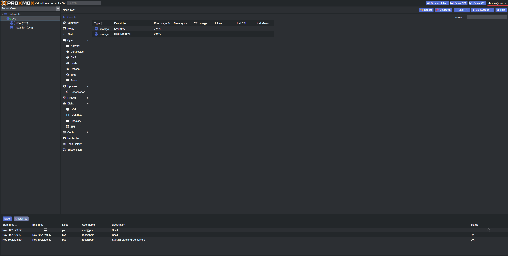
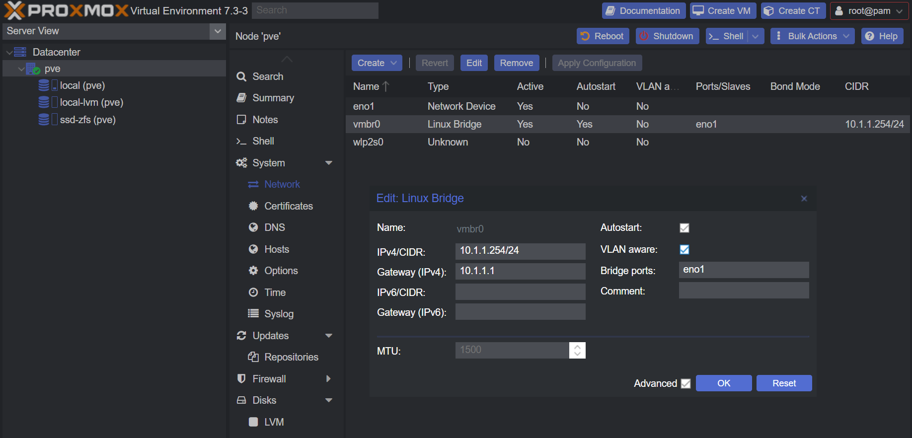
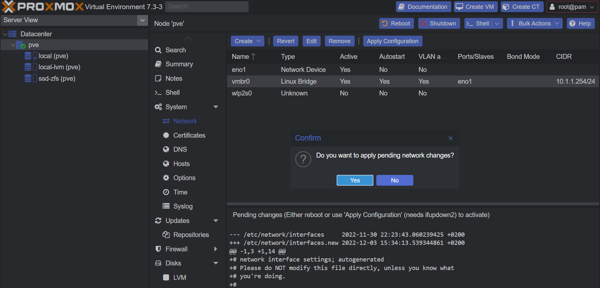
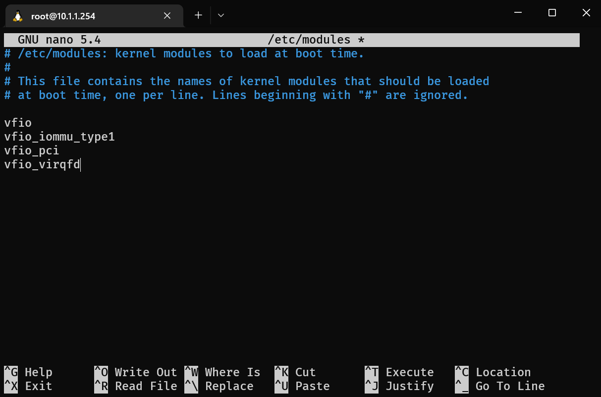

# First Tweaks

## Dark Theme

We will be using this [project](https://github.com/Weilbyte/PVEDiscordDark)

- Login to `Proxmox` webUI.
- Select your node on the left side
- Click <kbd>>_Shell</kbd> on the top right
- Run the following

  ```shell
  bash <(curl -s https://raw.githubusercontent.com/Weilbyte/PVEDiscordDark/master/PVEDiscordDark.sh ) install
  ```

  You will see an output similar to this

  ```shell
  Linux pve 5.15.74-1-pve #1 SMP PVE 5.15.74-1 (Mon, 14 Nov 2022 20:17:15 +0100) x86_64

  The programs included with the Debian GNU/Linux system are free software;
  the exact distribution terms for each program are described in the
  individual files in /usr/share/doc/*/copyright.

  Debian GNU/Linux comes with ABSOLUTELY NO WARRANTY, to the extent
  permitted by applicable law.
  Last login: Wed Nov 30 22:39:54 EET 2022 on pts/0
  root@pve:~# bash <(curl -s https://raw.githubusercontent.com/Weilbyte/PVEDiscordDark/master/PVEDiscordDark.sh ) install
  ✔ Backing up template file
  ✔ Downloading stylesheet
  ✔ Downloading patcher
  ✔ Applying changes to template file
  ✔ Downloading images (29/29)
  Theme installed.
  root@pve:~#
  ```

- Refresh your `Proxmox` webUI. (Might need to clear the cache)
  

## Remove Subscription pop-up

:::danger

This disables enterprise update repository,
if you have an enterprise license, do **NOT** follow the next steps

:::

We will be using this [project](https://github.com/foundObjects/pve-nag-buster)

It will remove this pop-up


Also it will remove the enterprise update repository,
which does not work without a valid subscription.

- SSH into `Proxmox` (WebUI Shell won't work)
- Run the following

  ```shell
  wget https://raw.githubusercontent.com/foundObjects/pve-nag-buster/master/install.sh
  bash install.sh
  ```

  You will see an output similar to this

  ```shell
  Linux pve 5.15.74-1-pve #1 SMP PVE 5.15.74-1 (Mon, 14 Nov 2022 20:17:15 +0100) x86_64

  The programs included with the Debian GNU/Linux system are free software;
  the exact distribution terms for each program are described in the
  individual files in /usr/share/doc/*/copyright.

  Debian GNU/Linux comes with ABSOLUTELY NO WARRANTY, to the extent
  permitted by applicable law.
  Last login: Wed Nov 30 23:44:39 2022
  root@pve:~# wget https://raw.githubusercontent.com/foundObjects/pve-nag-buster/master/install.sh
  bash install.sh
  --2022-11-30 23:46:38--  https://raw.githubusercontent.com/foundObjects/pve-nag-buster/master/install.sh
  Resolving raw.githubusercontent.com (raw.githubusercontent.com)... 185.199.108.133, 185.199.111.133, 185.199.110.133, ...
  Connecting to raw.githubusercontent.com (raw.githubusercontent.com)|185.199.108.133|:443... connected.
  HTTP request sent, awaiting response... 200 OK
  Length: 6102 (6.0K) [text/plain]
  Saving to: ‘install.sh.2’

  install.sh.2                  100%[=================================================>]   5.96K  --.-KB/s    in 0s

  2022-11-30 23:46:38 (27.0 MB/s) - ‘install.sh.2’ saved [6102/6102]

  Creating PVE no-subscription repo list ...
  Creating dpkg hooks in /etc/apt/apt.conf.d ...
  Fetching hook script from GitHub ...
  /tmp/tmp.67d4yekt1k/pve-nag-b 100%[=================================================>]   1.51K  --.-KB/s    in 0s
  Installing hook script as /usr/share/pve-nag-buster.sh
  Running patch script
  pve-nag-buster.sh: Disabling PVE paid repo list ...
  Cleaning up temporary files ...
  ```

## VLAN Aware

You can make proxmox NIC(s) VLAN Aware.

Navigate to under your Node -> `System` -> `Network`

- Select your NIC
- Click <kbd>Edit</kbd>
- Check `VLAN Aware`
- Click <kbd>OK</kbd>
- Click <kbd>Apply Configuration</kbd>
- Click <kbd>Yes</kbd>
  
  

## Enable IOMMU

SSH into the `Proxmox` Server.

### Update GRUB

```shell
nano /etc/default/grub
```

- Edit `GRUB_CMDLINE_LINUX_DEFAULT` line
  - Intel: `GRUB_CMDLINE_LINUX_DEFAULT="quiet intel_iommu=on"`
  - AMD: `GRUB_CMDLINE_LINUX_DEFAULT="quiet amd_iommu=on"`
- Press <kbd>CTRL</kbd> + <kbd>S</kbd> to save
- Press <kbd>CTRL</kbd> + <kbd>X</kbd> to exit
  

  ```shell
  update-grub
  ```

  Example output:

  ```shell
  root@pve:~#   update-grub
  Generating grub configuration file ...
  Found linux image: /boot/vmlinuz-5.15.74-1-pve
  Found initrd image: /boot/initrd.img-5.15.74-1-pve
  Found memtest86+ image: /boot/memtest86+.bin
  Found memtest86+ multiboot image: /boot/memtest86+_multiboot.bin
  Warning: os-prober will not be executed to detect other bootable partitions.
  Systems on them will not be added to the GRUB boot configuration.
  Check GRUB_DISABLE_OS_PROBER documentation entry.
  Adding boot menu entry for UEFI Firmware Settings ...
  done
  ```

### Add the required modules

```shell
nano /etc/modules
```

- Add the following

  ```shell
  vfio
  vfio_iommu_type1
  vfio_pci
  vfio_virqfd
  ```

  

- Press <kbd>CTRL</kbd> + <kbd>S</kbd> to save
- Press <kbd>CTRL</kbd> + <kbd>X</kbd> to exit

Once you are done with the above, `Reboot`
